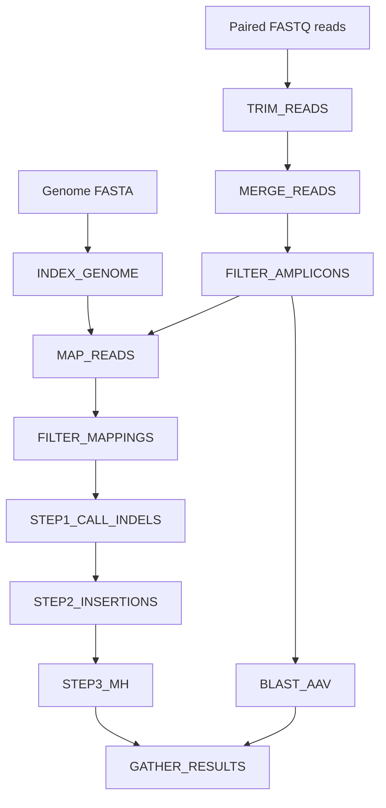

[](https://doi.org/10.5281/zenodo.19556421)

# CAAVIAR (CRISPR AAV Integration And Repair)

Amplicon-seq pipeline for CRISPR indel analysis with further characterisation of AAV vector integrations, insertions/deletions characteristics and microhomology-mediated repair.

Built with Nextflow.

Citation:
[Manuscript]

## Workflow

## File structure

```text
├── main.nf
├── nextflow.config
├── bin/
│     ├── run_crisprvariants_universal.R
│     ├── step2_aav_insertions.R
│     ├── step3_mh_analysis.py
│     └── gather_results.py
├── assets/
│     ├── blast_db/
│     ├── samples.csv
│     └── target_config.sh
└── modules/
      ├── trim.nf
      ├── merge.nf
      ├── filter_amplicons.nf
      ├── index_genome.nf
      ├── map_reads.nf
      ├── filter_mappings.nf
      ├── blast_aav.nf
      ├── step1_call_indels.nf
      ├── step2.nf
      ├── step3.nf
      └── gather.nf
```

## Requirements

- Nextflow ≥ 23.04
- Conda/Miniconda manager
- SLURM (for HPC runs) or any local executor


## Parameters & target configuration

All pipeline parameters (except `--csv` and `--config_file`) should be defined in the `.sh` target config file. 

| Parameter      | Default                          | Description                          |
|----------------|----------------------------------|--------------------------------------|
| `--csv`        | *(required)* | Path to samples CSV                  |
| `--config_file`| *(required)* | Path to target_config.sh             |

### Target Configuration File (`target_config.sh`)

The configuration file with experiment-specific variables is organized into the following sections:

**1. Paths**
* `fastq_dir`: Directory containing input sequencing reads.
* `genome_fasta`: Path to the reference genome sequence (`.fna` or `.fasta`).
* `outdir`: Directory where the pipeline will publish its results.

**2. Amplicon primers**
* `fw`: Forward primer sequence (used by seqkit for amplicon filtering).
* `rev`: Reverse primer sequence.

**3. Target site (Quantification window)**
* `blat_T_name`: The reference chromosome or contig name (e.g., `"NC_000068.7"`).
* `blat_T_start` / `blat_T_end`: The genomic start and end coordinates defining the filtering window. Reads must overlap these boundaries to be kept.
*  `amplicon`: The exact sequence of the target region where indels are quantified (usually +/- 50 bases around cut site).
* `cutSite`: The numerical position (integer) of the CRISPR cut site within the quanifiaction window sequence.

The following command should output the quantification window sequence:
```
samtools faidx reference_genomic.fna blat_T_name:blat_T_start-blat_T_end
```


**4. CrispRVariants output filenames**
* `restable` / `instable`: Internal filenames for the variant and insertion tables. No need to change these (defaults are `"results.csv"` and `"insertions.csv"`).

**5. minimap2 alignment scoring**
The defaults are specifically optimized for detecting AAV insertions:
* `minimap_A`: Matching score (default: `4`).
* `minimap_B`: Mismatch penalty (default: `27`).
* `minimap_O`: Gap open penalty (default: `32`).
* `minimap_E`: Gap extension penalty (default: `1`).

## Running the pipeline

### Local (single HPC run / workstation)
```bash
nextflow run main.nf \
    -profile local \
    --csv samples.csv \
    --config_file target_config.sh
```
### On SLURM (HPC)
```bash
nextflow run main.nf \
    -profile slurm \
    --csv samples.csv \
    --config_file target_config.sh
```

## Output directory layout

```
results_nextflow/
  bbtools_cleaned/
  merged_reads/
  bam/A4_B27_O32_E1/
  results/A4_B27_O32_E1/
    <sample>/
      results.csv                   ← CrispRVariants allele frequencies
      insertions.csv                ← CrispRVariants raw insertions
      <sample>_alignments.png       ← CrispRVariants alignment plot
      all_events_del.tsv            ← parsed deletions
      <sample>_merged_summary.csv   ← AAV + microhomology stats
  all_results_merged_summary.csv    ← Final combined analysis for all samples

```
