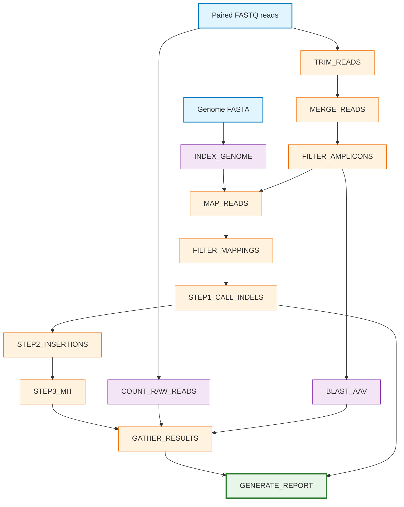

# CAAVIAR (CRISPR AAV Integration And Repair)

Amplicon-seq pipeline for CRISPR indel analysis with further characterisation of AAV vector integrations, insertions/deletions characteristics and microhomology-mediated repair.

Built with Nextflow.

Citation:
[Manuscript]

## Workflow

```mermaid
flowchart TB

    %% Inputs
    reads["Paired FASTQ reads"]
    genome["Genome FASTA"]

    %% Core pipeline
    COUNT_RAW["COUNT_RAW_READS"]
    TRIM["TRIM_READS"]
    MERGE["MERGE_READS"]
    FILTER_AMP["FILTER_AMPLICONS"]
    INDEX["INDEX_GENOME"]
    MAP["MAP_READS"]
    FILTER_MAP["FILTER_MAPPINGS"]
    BLAST["BLAST_AAV"]

    STEP1["STEP1_CALL_INDELS"]
    STEP2["STEP2_INSERTIONS"]
    STEP3["STEP3_MH"]
    GATHER["GATHER_RESULTS"]
    REPORT["GENERATE_REPORT"]

    %% Flow
    reads --> COUNT_RAW
    reads --> TRIM
    TRIM --> MERGE
    MERGE --> FILTER_AMP

    genome --> INDEX
    INDEX --> MAP

    FILTER_AMP --> MAP
    MAP --> FILTER_MAP

    %% Branch: indels
    FILTER_MAP --> STEP1
    STEP1 --> STEP2
    STEP2 --> STEP3

    %% Branch: AAV blast
    FILTER_AMP --> BLAST

    %% Merge results
    STEP3 --> GATHER
    COUNT_RAW --> GATHER
    BLAST --> GATHER
    GATHER --> REPORT
    STEP1 --> REPORT

    %% Styling
    classDef inputStyle fill:#e1f5fe,stroke:#0277bd,stroke-width:2px
    classDef processStyle fill:#fff3e0,stroke:#ef6c00
    classDef branchStyle fill:#f3e5f5,stroke:#7b1fa2
    classDef finalStyle fill:#e8f5e9,stroke:#2e7d32,stroke-width:3px

    class reads,genome inputStyle
    class TRIM,MERGE,FILTER_AMP,STEP1,STEP2,STEP3,MAP,FILTER_MAP,GATHER processStyle
    class COUNT_RAW,BLAST,INDEX branchStyle
    class REPORT finalStyle

```
## File structure

```text
├── main.nf
├── nextflow.config
├── bin/
│     ├── run_crisprvariants_universal.R
│     ├── step2_aav_insertions.R
│     ├── step3_mh_analysis.py
│     ├── gather_results.py
│     └── generate_html_report.py
├── assets/
│     ├── blast_db/
│     ├── samples_example.csv
│     └── target_config_example.config
└── modules/
      ├── count_raw_reads.nf
      ├── trim.nf
      ├── merge.nf
      ├── filter_amplicons.nf
      ├── index_genome.nf
      ├── map_reads.nf
      ├── filter_mappings.nf
      ├── blast_aav.nf
      ├── step1_call_indels.nf
      ├── step2.nf
      ├── step3.nf
      ├── gather.nf
      └── report.nf
```

## Requirements

- Nextflow ≥ 23.04
- Conda/Miniconda manager
- SLURM (for HPC runs) or any local executor


## Parameters & target configuration

All pipeline parameters, including the path to the samples CSV, are provided via a Nextflow configuration file (e.g. `.config`). 

| Parameter | Default | Description |
|---|---|---|
| `-c` | *(required)* | Path to the target configuration file (e.g. `target_config_example.config`) |

### Target Configuration File (`.config`)

The configuration file is a Nextflow config containing a `params` block with experiment-specific variables, organized into the following sections:

**1. Paths**
* `csv`: Path to the samples CSV file.
* `fastq_dir`: Directory containing input sequencing reads.
* `genome_fasta`: Path to the reference genome sequence (`.fna` or `.fasta`).
* `outdir`: Directory where the pipeline will publish its results.

**2. Amplicon primers**
* `fw`: Forward primer sequence (used by seqkit for amplicon filtering).
* `rev`: Reverse primer sequence.

**3. Target site (Quantification window)**

You can specify the target location using either a full reference genome or a custom amplicon sequence.

* **Using a full genome:** 
  Set `blat_T_name` to the chromosome/contig name (e.g., `"NC_000068.7"`), and `blat_T_start` / `blat_T_end` to the exact genomic coordinates of your filtering window. The following command should output your quantification window sequence:
  ```bash
  samtools faidx reference_genomic.fna blat_T_name:blat_T_start-blat_T_end
  ```

* **Using a custom amplicon FASTA:** 
  Instead of a full genome, you can point `genome_fasta` (in the Paths section) to a single-entry FASTA file containing exactly the amplicon sequence (from the forward to the reverse primer).

**For both methods, you must define the exact region for indel quantification:**
* `amplicon`: The exact sequence of the target region where indels are quantified (usually +/- 50 bases around the cut site).
* `cutSite`: The numerical position (integer) of the CRISPR cut site within the `amplicon` sequence.


**4. CrispRVariants output filenames**
* `restable` / `instable`: Internal filenames for the variant and insertion tables. No need to change these (defaults are `"results.csv"` and `"insertions.csv"`).

**5. minimap2 alignment scoring**
The defaults are specifically optimized for detecting AAV insertions:
* `minimap_A`: Matching score (default: `4`).
* `minimap_B`: Mismatch penalty (default: `27`).
* `minimap_O`: Gap open penalty (default: `32`).
* `minimap_E`: Gap extension penalty (default: `1`).

## Running the pipeline

### Local (single HPC run / workstation)
```bash
nextflow run main.nf \
    -profile local \
    -c /path/to/target_config.config
```
### On SLURM (HPC)
```bash
nextflow run main.nf \
    -profile slurm \
    -c /path/to/target_config.config
```

## Output directory layout

```
results_nextflow/
  bbtools_cleaned/
  merged_reads/
  bam/A4_B27_O32_E1/
  results/A4_B27_O32_E1/
    <sample>/
      results.csv                   ← CrispRVariants allele frequencies
      insertions.csv                ← CrispRVariants raw insertions
      <sample>_alignments.png       ← CrispRVariants alignment plot
      all_events_del.tsv            ← parsed deletions
      <sample>_merged_summary.csv   ← AAV + microhomology stats
  all_results_merged_summary.csv    ← Final combined analysis for all samples
  pipeline_report.html              ← Interactive HTML report with summary plots

```
